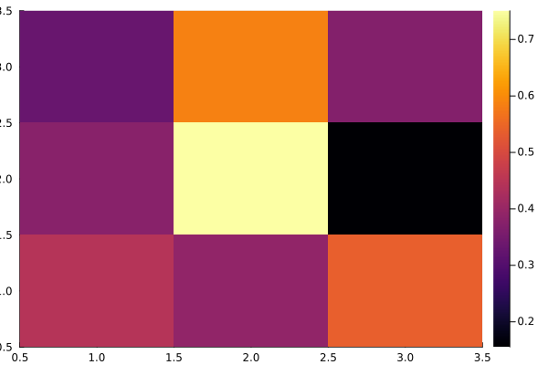
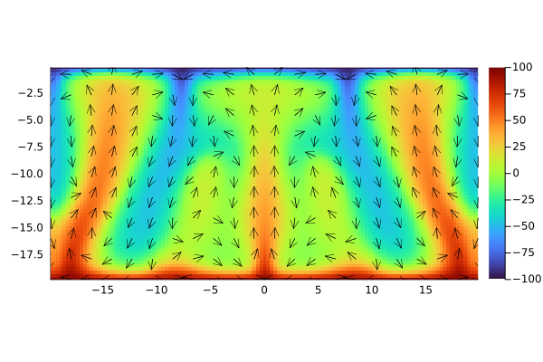
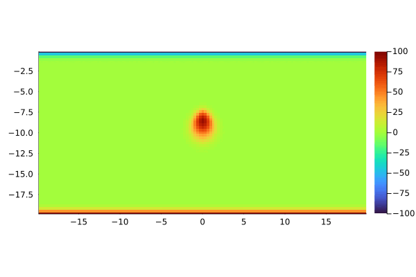
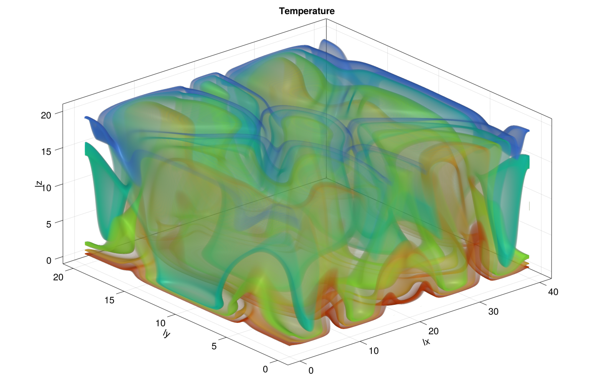

# PorousConvection

[](https://github.com/youwuyou/pde-on-gpu-wu/actions/workflows/CI.yml?query=branch%3Amain)


## Introduction

This tiny course project serves as a learning tool for understanding the workflow of a small Julia package and a good practice for implementing PDE solvers using the PT method.


## Structure

```bash
PorousConvection
├── LICENSE
├── Manifest.toml
├── Project.toml
├── README.md
├── scripts       # contains scripts for 2D & 3D porous convection solver
├── src
└── test          # contains unit and reference tests for 2D & 3D porous convection solver
```

## Documentation

This `README.md` serves as a concise overview of the first course project of course 101-0250-00 from HS22 week 07 - 09.

For the more concrete documentation of the functions used in the `PorousConvection`, please refer to the docstrings used for each method. 

Additionally for testing purpose we automate the use of `Literate.jl` by github action, which is specified by `.github/workflow/Literate.yml` located in the main folder outside of the current folder. This should run the `bin_io_script.jl` and generate a heatmap with randomized data which looks like the following example.

The `load_array` and `save_array` methods are documented as well.


 


# Theory

The thermal porous convection equations describe the evolution of pressure and temperature in porous media using the Darcy's law.

The governing equations used are as followed:

$$\vec{q_D} = -\frac{k}{\eta}(\nabla p - \rho \vec{g})$$

$$\nabla \cdot \vec{q_D} = 0$$ 

$$\vec{q_F} = -k \nabla T$$

$$\frac{\partial T}{\partial t}+\frac{1}{\varphi} \vec{q_D} \cdot \nabla T + \nabla \cdot \vec{q_T} = 0$$


## Numerical Method

Instead of using a direct solver, we apply the accelerated Pseudo-Transient method, which is a matrix-free method and it builds on a physical description of a process.

We follow the techniques learnt in the class and as introduced in [Räss et al. (2022)](https://gmd.copernicus.org/articles/15/5757/2022/), and introduce additional pseudo-time $\tau$ term.

The augmented equations look as followed:

$$\theta_D \frac{\partial \vec{q_D}}{\partial \tau} \color{b} + \vec{q_D} = - \frac{k}{\eta}(\nabla p - \rho_0 \alpha \vec{g} T)$$

$$\beta \frac{\partial P}{\partial \tau} \color{b}- \nabla \cdot \vec{q_D} = 0$$

$$\theta_T \frac{\partial \vec{q_T}}{\partial \tau} \color{b} +\vec{q_T} = - \frac{\lambda}{\rho_0 c_p} \nabla T$$  

$$\frac{\partial T}{\partial \tau} + \color{b} \frac{\partial T}{\partial t}+\frac{1}{\varphi} \vec{q_D} \cdot \nabla T + \nabla \cdot \vec{q_T} = 0$$

**NOTE:**    $\theta_i$ terms ↔ relaxation time


With enough iterations within the pseudo-time loop, the terms involving $\tau$ will disappear, the system of equations to be solved is recovered as stable state after the transient phase. 


---


## Porous convection 2D

**Structure:**
- `Pf_diffusion_2D_xpu.jl`     

    - complete the script from class using `@parallel` approach

    - Performance on V100 GPU `Time = 0.019 sec, T_eff = 320.776 GB/s`


- `Pf_diffusion_2D_perf_xpu.jl` 

    - complete the script from class using `@parallel_indices` approach

    - Performance on V100 GPU `Time = 0.019 sec, T_eff = 325.022 GB/s`


- `PorousConvection_2D_xpu.jl`  

    - edited from previous script with `@parallel` approach preferred


The `PorousConvection_2D_xpu.jl` is modified from the previous exercise `porous_convection_implicit_2D.jl` of week 04. The difference between it and the this week's script is that we slightly changed the parameters (eg. Raynolds number). The differences are commented within the script.

In our implementation from the serial code to the parallelized code, we preferred the approach of `@parallel` whenever possible.


#### Small 2D case

- *Lecture 7 - Task 1.3*

Using `ny = 63` , `nt = 500`, we obtain the identical plot for the final state as given in the task description

 


####  Large 2D case

- *Lecture 7 - Task 1.4*

With the following parameters, we run our code on the cluster "racklette" located at CSCS, using one Tesla V100 GPU, where we expected the run to take 1-2 hours of time.

```bash
Ra      = 1000
# [...]
nx,ny   = 511,1023
nt      = 4000
ϵtol    = 1e-6
nvis    = 50
ncheck  = ceil(2max(nx,ny))
```

*Memory throughput:*  

```bash
julia> include("PorousConvection_2D_xpu.jl")
Animation directory: viz_out/
Time = 7774.123 sec, T_eff = 115.558 GB/s 
```


The resulted plots are stored as png files and converted to gif

 


---


## Porous convection 3D

**Structure:**

- `Pf_diffusion_3D_xpu.jl`

    - complete the script from class using `@parallel` approach

    - using ParallelStencil.FiniteDifferences3D submodule
                                
    - `Time = 14.278 sec, T_eff = 293.071 GB/s` on Tesla V100 GPU

- `PorousConvection_3D_xpu.jl`  

    - edited from `PorousConvection_2D_xpu.jl` script with `@parallel` approach preferred


#### Small 3D case (slice)

- *Lecture 7 - Task 2.2*

For lecture 7, exercise 2.2 we have the following gif. animation produced. The resulted plots of the 2D slices in 3D case are stored as png files and converted to gif

 


#### Large 3D case (final $T$)

- *Lecture 7 - Task 2.3*

With the following parameters, we run our code on the cluster "racklette" located at CSCS, using one Tesla V100 GPU where we expected the run to take 2 hours of time.

```bash
Ra       = 1000
# [...]
nx,ny,nz = 255,127,127
nt       = 2000
ϵtol     = 1e-6
nvis     = 50
ncheck   = ceil(2max(nx,ny,nz))
```

*Memory throughput:*  
```bash
Time = 5315.426 sec, T_eff = 359.388 GB/s 
```

Here is the final 3D animation showing evolution of temperature with GLMakie

 


---

## Testing

- supported tests include testing scripts for 2D & 3D cases, which are `test/test2D.jl` and `test/test3D.jl`.

- The seperation of the tests into 2D and 3D is due to the more convinient use of `ParallelStencil.FiniteDifferences2D/3D` modules

- unit and reference tests use data from the cpu solver provided by the course organizer as comparison

```bash
# activate the project environment
julia --project

# use package mode
] 

# verify (PorousConvection) pkg> can be seen and run the tests by
test
```

Following outputs are expected

```julia
Testing PorousConvection.jl
Test Summary:                         | Pass  Total
Unit test: PorousConvection_2D_xpu.jl |    1      1
Time = 1.799 sec, T_eff = 0.010 GB/s 
Test Summary:                              | Pass  Total
Reference test: PorousConvection_2D_xpu.jl |   10     10
Test Summary:                         | Pass  Total
Unit test: PorousConvection_3D_xpu.jl |    1      1
Time = 1.819 sec, T_eff = 4.076 GB/s 
Test Summary:                              | Pass  Total
Reference test: PorousConvection_3D_xpu.jl |    5      5
     Testing PorousConvection tests passed 
```


---

##   Troubleshooting


### Diffusion

- for the computation of the diffusion equation using 1 GPU, it seems like the performance is not improved by defining a kernel function for the error tracking of `r_Pf`

The following function definition was added

```julia

@parallel function calc_r_Pf!(r_Pf, qDx, qDy, _dx, _dy)
    @all(r_Pf)  = @d_xa(qDx) * _dx + @d_ya(qDy) * _dy
    return nothing
end

```

And it is called within do_check 

```julia
            @parallel calc_r_Pf!(r_Pf, qDx, qDy, _dx, _dy)
```

Which caused the performance to drop from `Time = 0.019 sec, T_eff = 327.480 GB/s ` to `Time = 0.103 sec, T_eff = 59.444 GB/s` on a single Nvidia Tesla V100 GPU. 
