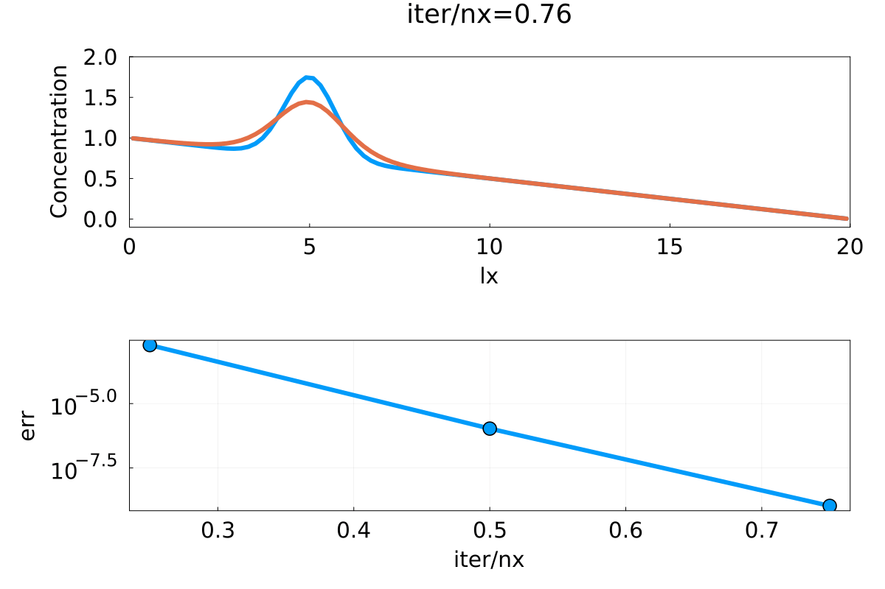
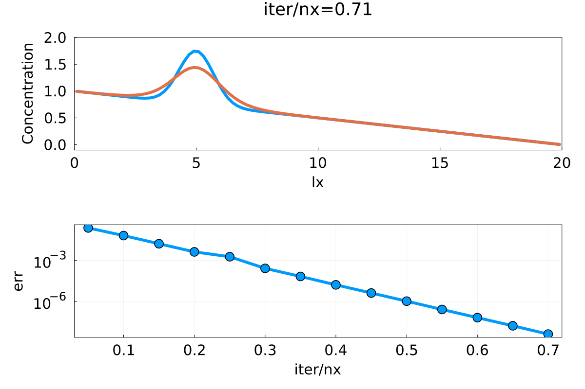
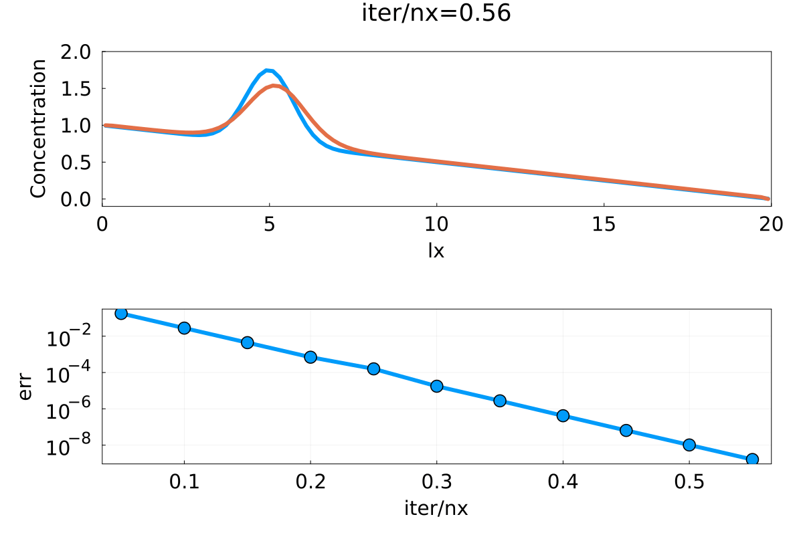
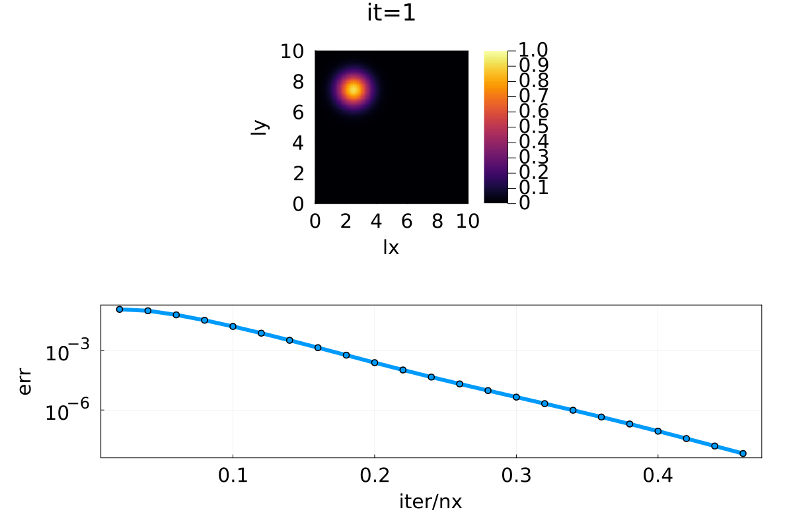
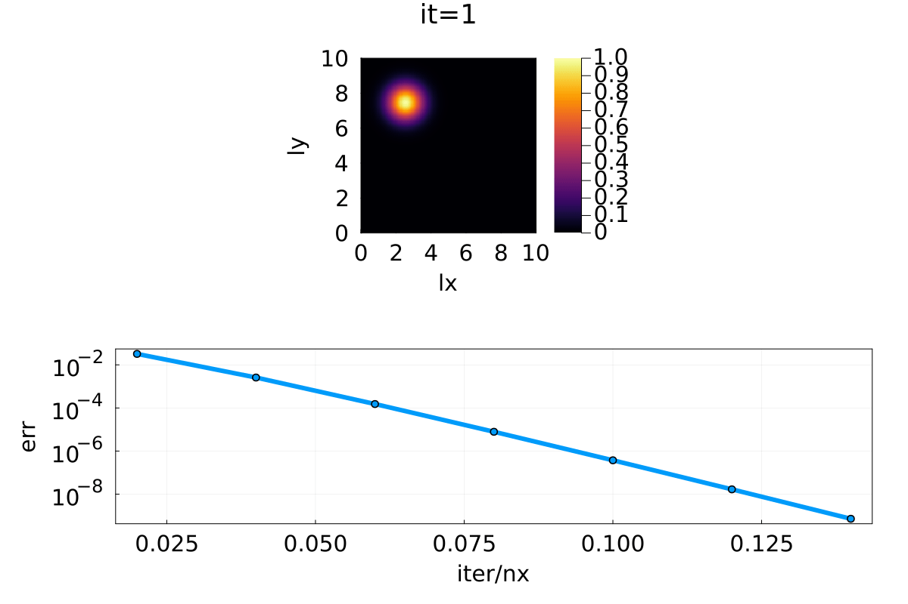
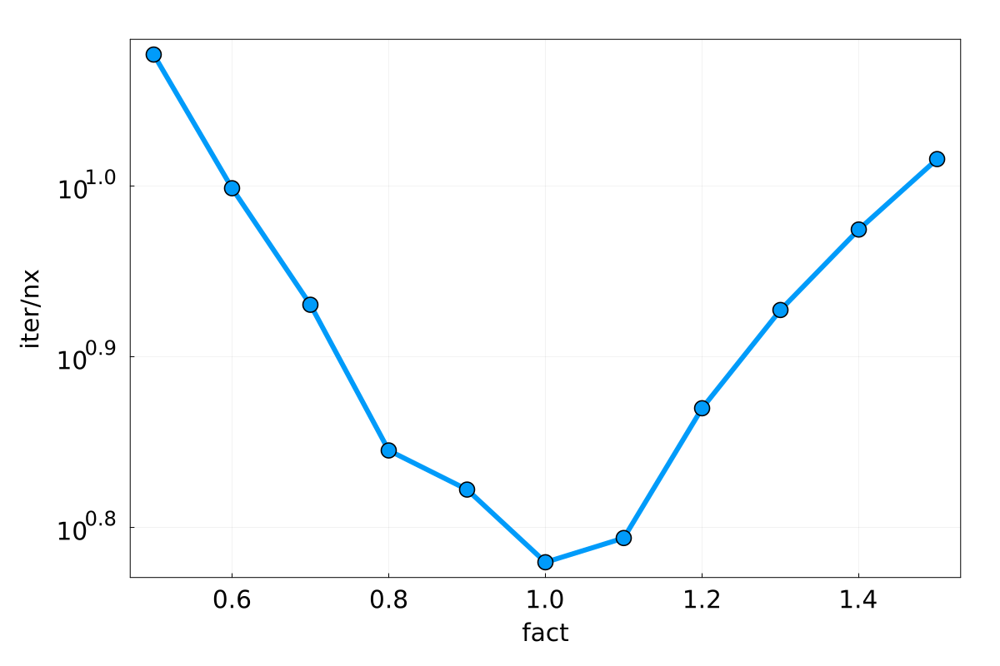

# Lecture 3: Solving elliptic PDEs

- Code exercise 3.1 ↔ `implicit_diffusion_1D.jl`

- Code exercise 3.2 ↔ `implicit_transient_advection_diffusion_1D.jl`

- Code exercise 3.3 ↔ `implicit_advection_diffusion_2D.jl`

- Code exercise 3.4 ↔ `steady_diffusion_parametric_1D.jl`

## Code exercise 3.1:  Implicit transient diffusion using dual timestepping

**Idea:** Using structurally similar diffusion-reaction 1D solver and change it to solve the implicite transient diffusion problem.

### Task 1: Implementation of the solver

- renaming & resetting of the variables

- introduce dual time-stepping using nested loops

=> Outer loop: `nt = 10` as physical time steps

=> Inner loop: pseudo transient iterations

### Task 2: Numerical experiment using the solver

- Plot the gif-animations of:

a) the spatial distribution of concentration C after nt=10 time steps, on top of the plot of the initial concentration distribution

b) the error as function of iteration/nx.

=>  visualization realized in the 1st loop (physical loop)

Case 1: `nt = 10` & `ncheck  = ceil(Int,0.25nx)`

 

Case 2: `nt = 40` & `ncheck  = ceil(Int,0.05nx)`

 

 - Description:

Using the structural similarity of the code, we implemented the transient diffusion solver using the steady reaction-diffusion solver as provided from the class and plotted the evolution of the solution and the error evolution of the solver.

 We can clearly see the accelerated method converges very fast to the steady state.

---

## Code Exercise 3.2:  Operator-splitting for advection-diffusion

**Idea:** Modify code from exercise 3.2 and add the advection term in the outer loop (physical timestepping)

### Task 1: implement solver

- using stability criteria for advection `dt = dx/abs(vx)`

- Dämkohler's number as derived property `da = lx^2/dc/dt`

_Case 1: With boundary condition_

- `C[1] = 1`, `C[end] = 0`

 

_Case 2: Without boundary condition_

 

- Description:  

The solution with the boundary condition seems more reasonable to me. 

I am not sure if the boundary conditions should be simply manually set like this or if there are better ways to incorporate them.

---

## Code Exercise 3.3: Advection-diffusion in 2D

### Task 1: implementation without advection

- Dimensional consideration

For the derivatives we need to consider about the dimensions of the array. Following were the notes taken during the implementation:

Given C /in R^{100, 100}

`diff(C, dims=1)` => 99 x 100

`diff(C, dims=2)` => 100 x 99

- qx /in R^{99, 100}

`diff(qx, dims=2)` => {99,99}

- qy /in R^{100, 99}

`diff(qx, dims=1)` => {99,99}

_Case 1: Without advection_

 

### Task 2: implementation with advection

Note: the upwind strategy is needed for the advective term, where we do case distinctions both for vx, vy.

_Case 2: With advection_

- using the velocities as required in the task decription

- velocities `vx = 1.0` , `vy = -1.0`

 

_Case 3: With advection (accelerated)_

- in order to see the moving effect more clearly, I slightly highered the magnitude of the initial velocities

- velocities `vx = 30.0` , `vy = -30.0`

 

---

## Code Exercise 3.4: Optimal iteration parameters for pseudo-transient method

Goal: verify numerically the optimality of the chosen pseudo-transient parameters.

Set-up: 1D elliptic solver for the steady-state diffusion

### Task 1: Study of the convergence rate

- experiment uses the script `l3_steadt_diffusion_1D.jl`   

In the original code we have the following parameter

=> `ρ  = (lx/(dc*2π))^2`

- We vary the numerical parameter `re` 

    `re = 2π*fact[ifact]`
    
    `ρ  = (lx/(dc*re))^2`

=> `ρ  = (lx/(dc * 2π*fact[ifact] ))^2`

- Plotted result:

 

We observe that we have the less iteration steps to do when fact is around 1.0 - 1.1. Which verifies the original choice of dc*2π as denominator for the choice of ρ.