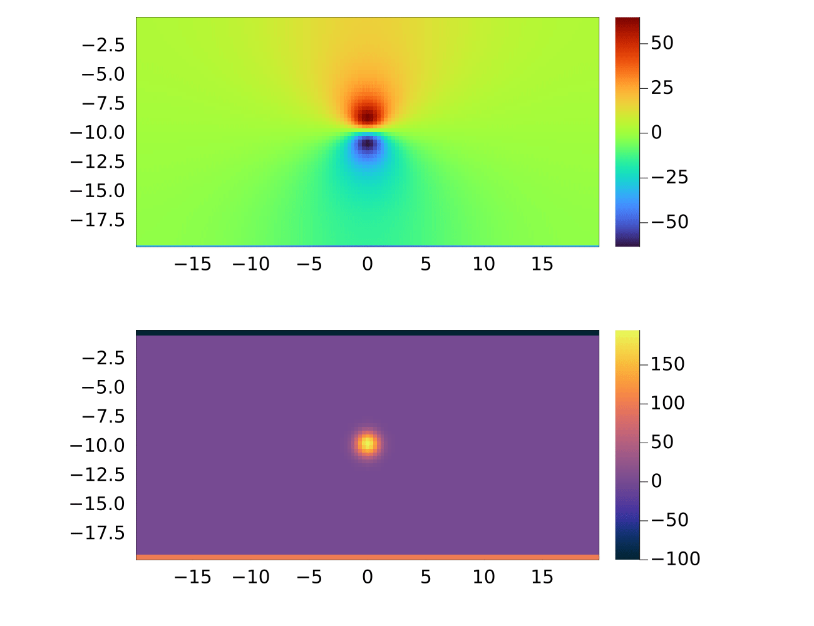
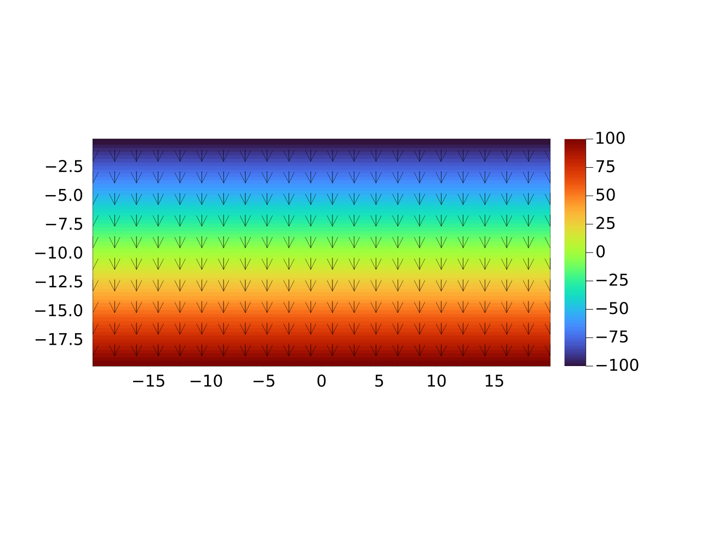
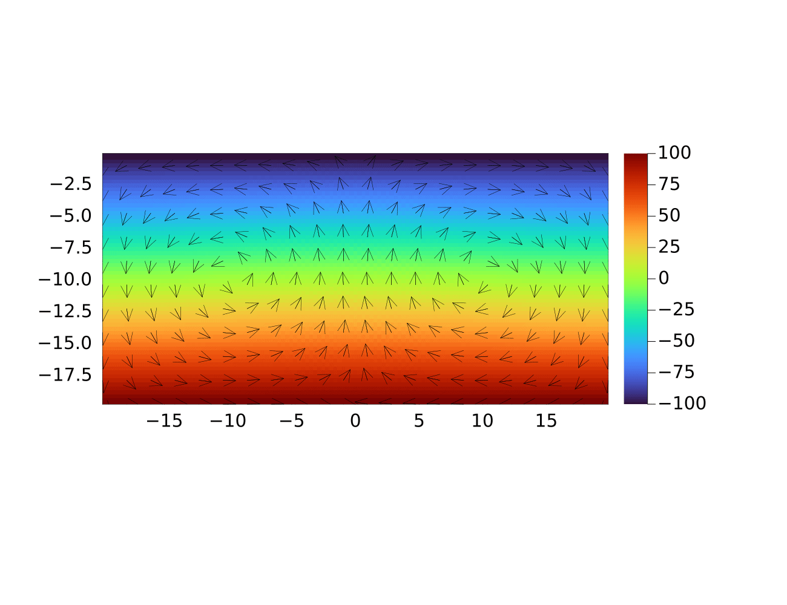
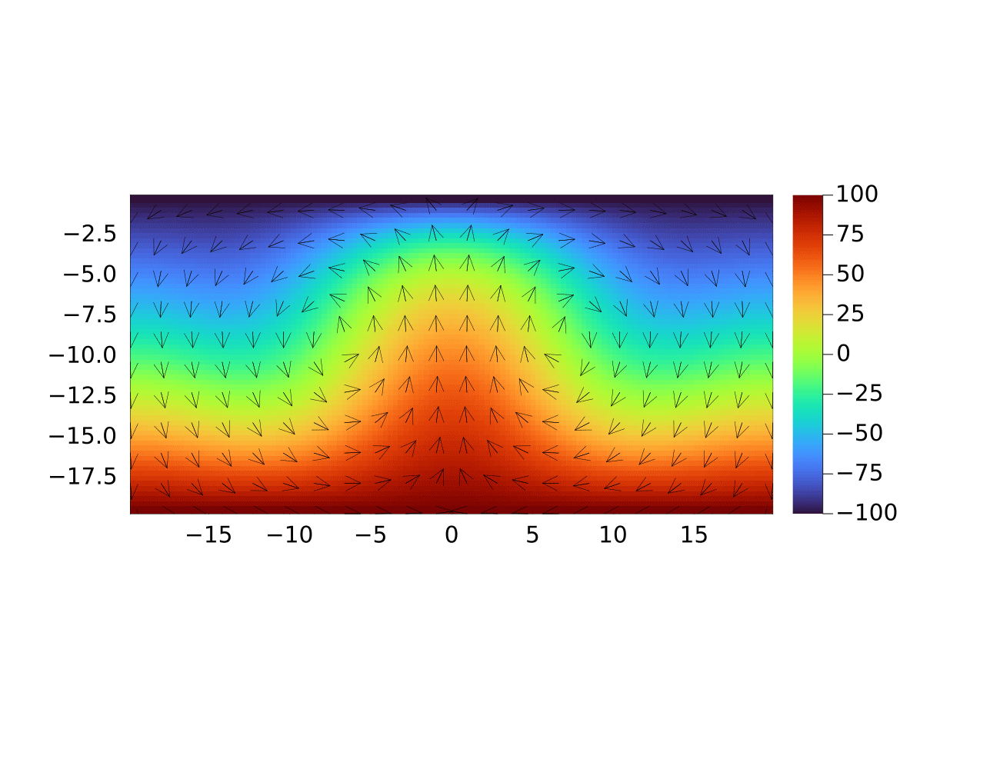

Lecture 4: Solving elliptic PDEs

- Code exercise 4.1 
                    Task 1-4  ↔ `porous_convection_2D_heatmap.jl`
                    Task 5    ↔ `porous_convection_2D_quiver.jl`


- Code exercise 4.2
                    Task 1-2 ↔ `porous_convection_implicit_2D.jl`
                    Task 3   ↔ `ra_experiments.jl`


## Code Exercise 4.1: Thermal porous convection in 2D

We finally want to solve a system of coupled PDE which model the incompressible flow in porous material.

- blue terms <->  Darcy flux
- red terms  <->  Temperature flux
 
$$
 \color{blue}\theta_D \frac{\partial \vec{q_D}}{\partial \tau}  + \vec{q_D} = - \frac{k}{\eta}(\nabla p - \rho_0 \alpha \vec{g} T)
$$

$$
\color{blue} \beta \frac{\partial P}{\partial \tau} + \nabla \cdot \vec{q_D} = 0
$$

$$
\color{red} \theta_T \frac{\partial \vec{q_T}}{\partial \tau}  +\vec{q_T} = - \frac{\lambda}{\rho_0 c_p} \nabla T
$$

$$
\color{red} \frac{\partial T}{\partial \tau} +  \frac{\partial T}{\partial t}+   \frac{1}{\varphi} \vec{q_D} \cdot \nabla T + \nabla \cdot \vec{q_T} = 0
$$

### Task 1: Solve equation for pressure (1D)

- *Darcy’s law*
- Start point:  Steady diffusion 1D

$$
    \rho \frac{\partial q}{\partial \tau} \color{b}+ \frac{1}{D} q = - \frac{\partial C}{\partial x}
$$

$$
\frac{\partial C}{\partial \tau} + \frac{\partial q}{\partial x}=0
$$

- NOTE:  we had `D = 1.0` in our previous code, following is the equation we try to solve in first task by renaming the variables.

$$  
{\color{purple}\theta_D}\frac{\partial q_D}{\color{purple}{\partial \tau}} \color{b}+ \frac{k}{\eta_f} q_D = - \frac{\partial P_f}{\partial x}
$$

$$
\color{pink}\beta \color{b} 
\frac{\partial P_f}{\color{pink}\partial \tau} - \frac{\partial q_D}{\partial x}= 0
$$

 


### Task 2: Solve equation for pressure (2D)

- Approach:   simply adding needed `#numerics` for the additional direction

- Result:    2D heat map showing wave-like patterns at the beginning of the iterations

 

 - NOTE: the initial condition used was the same as the one on the website, which differs from the one from the script `l5_Pf_diffusion_2D.jl`

Following is the result (truncated) from the one-line code that prints out the convergence results within the `ncheck` block. The whole result is stored as the `darcy_2D.out` in the `docs/` folder.

```
  iter/nx=0.2, err_Pf=9.016e-02
  iter/nx=0.5, err_Pf=3.764e-02
  ...
  iter/nx=7.2, err_Pf=1.570e-08
  iter/nx=7.5, err_Pf=8.064e-09
```

### Task 3: Visualization outside of the iteration loop & Error monitoring

Followingly is the truncated output

```
it = 1, iter/nx=7.0, err_Pf=9.326e-09
it = 2, iter/nx=0.3, err_Pf=6.279e-09
...
it = 9, iter/nx=0.3, err_Pf=1.262e-10
it = 10, iter/nx=0.3, err_Pf=8.299e-11

```


More see the `transient_darcy_2D.out` in `docs/` folder


### Task 4: Add fields for the temperature evolution

Till now we have implemented the equations for pressure, where temperature was omitted.

We added the terms for the temperature evolution in this task. Followingly are the equations to be solved (without adding the pseudo terms)


*Part 1:  Darcy flux*

$$
\vec{q_D} = -\frac{k}{\eta} (\nabla P-\rho_0\alpha \vec{g}T)
$$

$$
\nabla \cdot \vec{q_D} = 0
$$

---

*Part 2:  Temperature*

$$
\frac{\partial T}{\partial t} + \frac{1}{\varphi}\vec{q_D} \cdot \nabla T -\frac{\lambda}{\rho_0C_p} \nabla \cdot (\nabla T) = 0
$$

---


- Subtask 1:  add temperature term to the existing momentum equation for the Darcy’s flux


Add transient terms to the equations to be solved implicitly ⇒ part 1

(eq⭐)

$$
{\color{red} \theta_D \frac{\partial q_D}{\partial  \tau}}\vec{q_D} = -\frac{k}{\eta} (\nabla P-\rho_0\alpha \vec{g}T)
$$

---

- Subtask 2: discretize equations for the temperature

For the mass-balance equation

$$
\frac{\partial T}{\partial t} + \frac{1}{\varphi}\vec{q_D} \cdot \nabla T -\frac{\lambda}{\rho_0C_p} \nabla \cdot (\nabla T) = 0
$$

discretizing in x-direction

$$
\frac{\partial T}{\partial t} + \frac{1}{\varphi}\vec{q_D} \cdot \frac{\partial T}{\partial x} -\frac{\lambda}{\rho_0C_p} \frac{\partial}{\partial x}(\frac{\partial T}{\partial x}) = 0
$$

$$
\frac{\partial T}{\partial t} + \frac{1}{\varphi}\vec{q_D} \cdot \frac{\partial T}{\partial x} -\frac{\lambda}{\rho_0C_p} \frac{\partial^2 T}{\partial x^2} = 0
$$


In the plot we can see the temperature and the pressure are experiencing advection and diffusion.

 

More see the `with_temperature_2D.out`

```
it = 1, iter/nx=9.8, err_Pf=8.515e-09
it = 2, iter/nx=8.3, err_Pf=8.140e-09
it = 3, iter/nx=8.3, err_Pf=7.306e-09
...
it = 496, iter/nx=7.8, err_Pf=9.333e-09
it = 497, iter/nx=7.8, err_Pf=9.000e-09
it = 498, iter/nx=7.8, err_Pf=8.892e-09
it = 499, iter/nx=7.8, err_Pf=8.866e-09
it = 500, iter/nx=7.8, err_Pf=8.828e-09
```


### Task 5: Plotting using quiver

Added terms:

```
    qDxc      = zeros(Float64, nx, ny)               # 100 x 50
    qDyc      = zeros(Float64, nx, ny)               # 100 x 50
    qDmag     = zeros(Float64, nx, ny)

```

 


---


## Code Exercise 4.2: Thermal porous convection with implicit temperature update


### Task 1 & 2: solve the temperature equations implicitly


Following we obtain the result of the implementation

 


*Problem encountered:*

i). I am not so sure what shall be the right definition of the err_T for the temperature flux, so currently I am not using the criteria `while max(err_D, err_T) >= ϵtol && iter <= maxiter` for the iteration loop. Because the `err_T` I obtain when checking the error is very large. 

ii). Why does the moving "heat ball" that I plotted seems to be 'weaker' than the one in the provided plotting reference?

---

_Did the number of iterations required for convergence change compared to the version with the explicit temperature update?_


*Comparison*

| solver type | no.iterations |
| --- | --- |
| implicit `Pr`, explicit `T`| 504448 |
| implicit `Pr`, implicit `T`| 271936 |


*Yes.* The number of iterations needed is now halved. But In my case the err_T cannot be correctly compute so the iteration loop cannot be broken when it can be broken already. The condition for the iteration loop I used was `while err_D >= ϵtol && iter <= maxiter`, leaving the `err_D` unused.

But ideally the number of iterations ought to be propotional to `nx`, if the `err_T` is correctly utilized.


---

_Why the number of iterations changed the way it changed? Write a sentence about your thoughts on the topic._


*Reason of the changes:*  The number of iterations is reduced because the solver type for the temperature flux is now implicit with the pseudo-transient parameters. Also for a better reduction of the no. iterations required, we need to find the optimal pseudo-transient parameter β.


### Task 3: Numerical experiment - Vary the Rayleigh number

We try out the following range of values for the Rayleigh number. Where `nt = 100` is set for each value.


- Case 1:  `Ra < 40`

Expected:   no convection

Obeservation:  indeed we observe (nearly) no convection for both cases

`Ra == 10`

 


`Ra == 40`


 


- Case 2:  `Ra > 40`

Expected:   development of convection

Observation:  we can observe the development of the convection is more significant as the Rayleigh's number gets larger.

`Ra == 100`

 


`Ra == 1000`

 


Question: What is the difference in the results for the different values of Ra, is there an observable trend? Write a comment explaining your observations.

| Rayleigh's number | no.iterations | 
| --- | --- |
| 10.0 | 247892 |
| 40.0 | 1144860 |
| 100.0 | 76864 |
| 1000.0 | 55296 |


- Difference:  

Ra is decisive for the equations to be solved. It decides whether the diffusive effect or the advection effect is more dominant.


- Trend:

The trend is observable. The larger the `Ra` is, the more dominant is the convection in the solution equation. 
