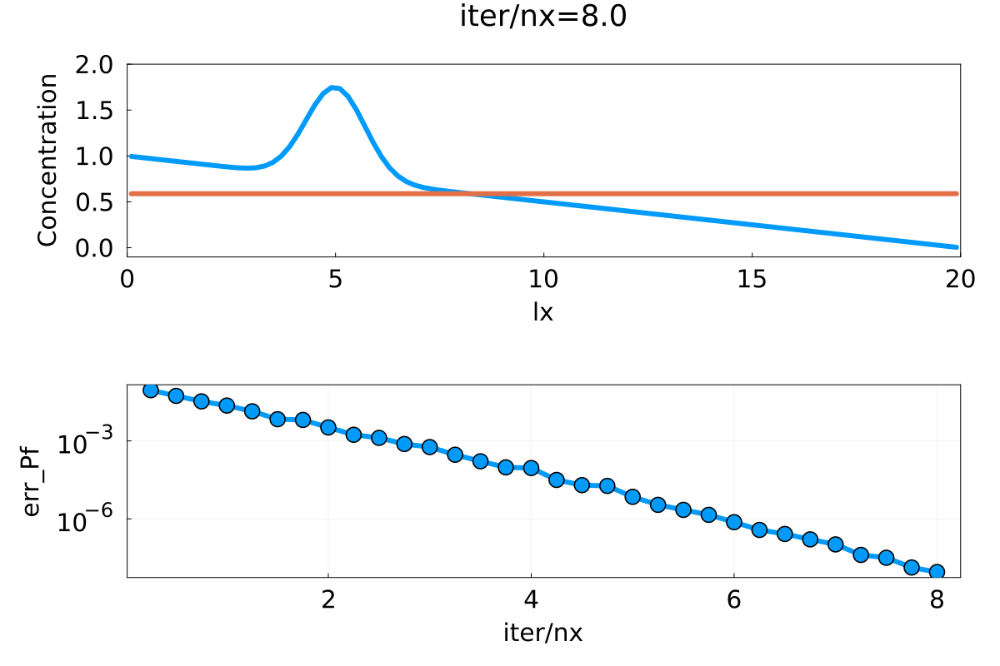
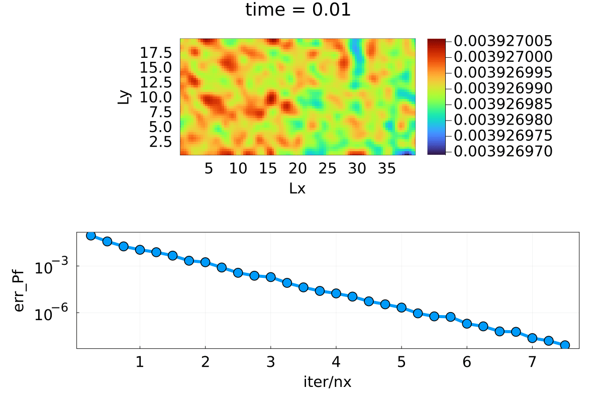
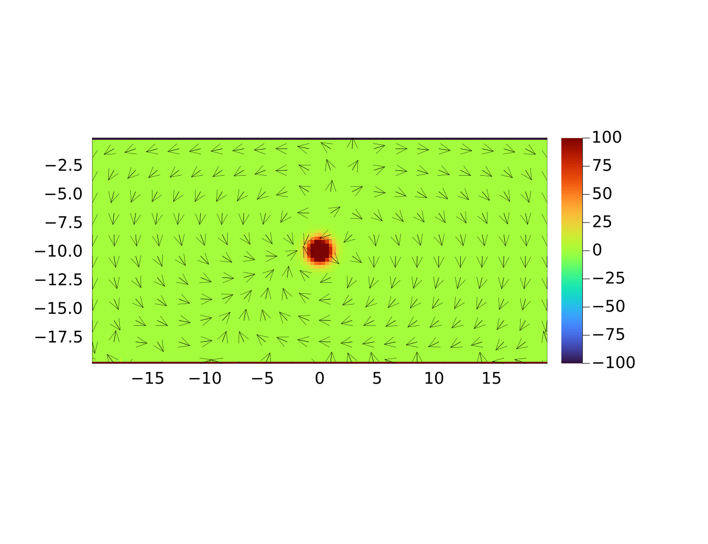

Lecture 4: Solving elliptic PDEs

- Code exercise 4.1 ↔ `porous_convection_2D.jl`

- Code exercise 4.2 ↔ `todo`


## Code Exercise 4.1: Thermal porous convection in 2D

We finally want to solve a system of coupled PDE which model the incompressible flow in porous material.

- blue terms <->  Darcy flux
- red terms  <->  Temperature flux
 
$$
 \color{blue}\theta_D \frac{\partial \vec{q_D}}{\partial \tau}  + \vec{q_D} = - \frac{k}{\eta}(\nabla p - \rho_0 \alpha \vec{g} T)
$$

$$
\color{blue} \beta \frac{\partial P}{\partial \tau} - \nabla \cdot \vec{q_D} = 0
$$

$$
\color{red} \theta_T \frac{\partial \vec{q_T}}{\partial \tau}  +\vec{q_T} = - \frac{\lambda}{\rho_0 c_p} \nabla T
$$

$$
\color{red} \frac{\partial T}{\partial \tau} +  \frac{\partial T}{\partial t}+   \frac{1}{\varphi} \vec{q_D} \cdot \nabla T + \nabla \cdot \vec{q_T} = 0
$$

### Task 1: Solve equation for pressure (1D)

- *Darcy’s law*
- Start point:  Steady diffusion 1D

$$
    \rho \frac{\partial q}{\partial \tau} \color{b}+ \frac{1}{D} q = - \frac{\partial C}{\partial x}
$$

$$
\frac{\partial C}{\partial \tau}- \frac{\partial q}{\partial x}=0
$$

- NOTE:  we had `D = 1.0` in our previous code, following is the equation we try to solve in first task by renaming the variables.

$$  
{\color{purple}\theta_D}\frac{\partial q_D}{\color{purple}{\partial \tau}} \color{b}+ \frac{k}{\eta_f} q_D = - \frac{\partial P_f}{\partial x}
$$

$$
\color{pink}\beta \color{b} 
\frac{\partial P_f}{\color{pink}\partial \tau} - \frac{\partial q_D}{\partial x}= 0
$$

 


### Task 2: Solve equation for pressure (2D)

- Approach:   simply adding needed `#numerics` for the additional direction

- Result:    2D heat map showing wave-like patterns at the beginning of the iterations

 

 - NOTE: the initial condition used was the same as the one on the website, which differs from the one from the script `l5_Pf_diffusion_2D.jl`

Following is the result (truncated) from the one-line code that prints out the convergence results within the `ncheck` block. The whole result is stored as the `darcy_2D.out` in the `docs/` folder.

```
  iter/nx=0.2, err_Pf=9.016e-02
  iter/nx=0.5, err_Pf=3.764e-02
  ...
  iter/nx=7.2, err_Pf=1.570e-08
  iter/nx=7.5, err_Pf=8.064e-09
```

### Task 3:

`transient_darcy_2D.out`


 


### Task 4:

todo

### Task 5:


## Code Exercise 4.2: Thermal porous convection with implicit temperature update


### Task 1:

### Task 2:


