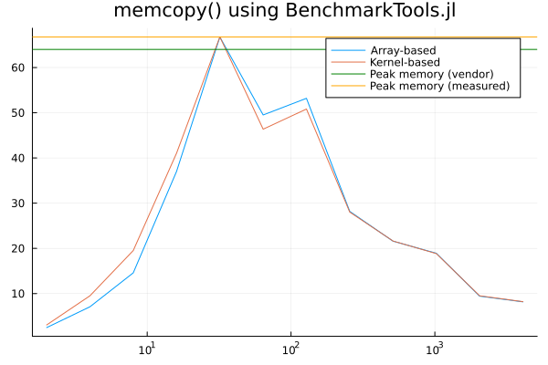
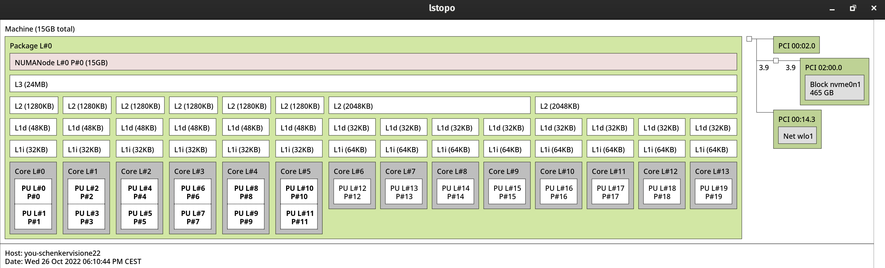

Lecture 5: Parallel computing

- Code exercise 5.1
                    `Pf_diffusion_2D_Teff.jl`
                    `Pf_diffusion_2D_Perf.jl`
                    `Pf_diffusion_2D_loop_fun.jl`

- Code exercise 5.2
                    Task 1 - 2 ↔ `memcopy.jl`


- Code exercise 5.3
                    Task 1 -  ↔ `Pf_diffusion_2D_Test.jl`
                   

## Code Exercise 5.1: Performance implementation: Diffusion 2D

We run the following scripts using the command `julia -O3 --check-bounds=no -t 20` on the local laptop.


```bash
 ╰─λ lscpu
Architecture:            x86_64
  CPU op-mode(s):        32-bit, 64-bit
  Address sizes:         39 bits physical, 48 bits virtual
  Byte Order:            Little Endian
CPU(s):                  20
  On-line CPU(s) list:   0-19
Vendor ID:               GenuineIntel
  Model name:            12th Gen Intel(R) Core(TM) i7-12700H

```


i). `Pf_diffusion_2D_Teff.jl`

- `T_eff` implementation


```
Time = 5.482 sec, Teff = 3.302, niter = 90 
```


ii). `Pf_diffusion_2D_Perf.jl`

- added scalar precomputations, avoided divisions

- added `do_check=false` to disable ncheck


```
Time = 3.827 sec, Teff = 4.730, niter = 90 
```


iii). `Pf_diffusion_2D_loop_fun.jl`

- added `compute!()` functions

- added macro for derivatives

- added multithreading using `Threads.@threads` infront of the outer for-loop


```
Time = 0.000 sec, Teff = 113.205, niter = 1 
```


*Misc: tested on 10 threads regarding row-/col-major*

```
julia> include("Pf_diffusion_2D_Perf_loop_fun.jl")
Time = 0.000 sec, Teff = 112.565, niter = 1 

julia> include("Pf_diffusion_2D_Perf_loop_fun.jl")
Time = 0.000 sec, Teff = 28.966, niter = 1 

```


---

## Code Exercise 5.2: Performance evaluation: Diffusion 2D (strong scaling test)


### Task 1: memcopy implementation


*Case 1: btool version*

```bash
julia> include("memcopy.jl")
Array based:  Time = 0.000 sec, Teff = 70.798, niter = 1 
Kernel based:  Time = 0.000 sec, Teff = 70.860, niter = 1 
```

*Case 2: Loop version*

```bash
julia> include("memcopy.jl")
Array based:  Time = 1.803 sec, Teff = 69.778, niter = 20000 
Kernel based:  Time = 1.807 sec, Teff = 69.643, niter = 20000 
```


### Task 2: Finding out $T_\text{peak}$

Under the assumption that the $T_\text{eff} \approx T_\text{peak}$, we called the implemented `memcopy()` using a wrapper function with the signature `function mem_throughput(; start_at_two = true)`, where the `start_at_two` is optional if one wants to start from `nx = 2` till `nx = 4096`


#### Performance Analysis

 

The resulting plot shows the effective memory grows linearly until the maximal effective (peak) memory is reached, and then the plot decays linearly, where we can see another local maximum alongside.

The best value of `memcopy()` obtained using the manual loop-based approach (manual timer) to assess T_\mathrm{peak}T peak is indicated in the plot.

The announced peak memory bandwidth is 64GB/S according to the vendor [intel](https://ark.intel.com/content/www/us/en/ark/products/132228/intel-core-i712700h-processor-24m-cache-up-to-4-70-ghz.html). Using the plot we can see that the measured peak performance is *66 GB/s*, which can be reached with a domain with $nx \times ny = 32 \times 32 = 1024$ values (i.e. 8192 Byte = 65.536 KB).

Using `lstopo` we obtain the following hardware topology of our CPU.

 


Notably the size of the L1d cache is 48KB, we thus assume that the peak memory is reached where the L1d cache gets fully utilized. The existence of the L2 and L3 caches may be one of the reasons why another local maximum exists. After the caches get filled, the effective memory starts to get reduced since the data has to be fetched from the RAM.


The above analysis is based on the btool version of the benchmark. The loop-based version provides a similar plot but the first values are missing because the warm-up iterations are not considered in our plot.

 


---

_Side-Note:_ Is there any way to have a semilog plot where the x-axis can scale where base = 2? I tried to set `xscale= :log2` but it showed me:

```bash
┌ Warning: scale log2 is unsupported with Plots.GRBackend().  Choose from: [:identity, :log10]
└ @ Plots ~/.julia/packages/Plots/530RA/src/args.jl:1677
```


---

## Code Exercise 5.3: Unit test

In the following exercise we changed the function signature to `function Pf_diffusion_2D(nx_, ny_;do_check=false)` in order to perform unit tests more practically.

Besides of that we added the testing parameters as followed right above the iteration loop

```
    # testing
    xtest = [5, Int(cld(0.6*lx, dx)), nx-10]
    ytest = Int(cld(0.5*ly, dy))
```

At the end we want the function to have selected return values depending on the entries given by `xtest`, `ytest` arrays.

```
    return Pf[xtest, ytest]

```


The definition of the testset is straight forward. The only thing we need to pay attention to is the type matching between the return type and the values to be compared. Thus we reshaped the return values of the function, after this we are able to do direct comparison between the values using '≈'.

 Our testset has the following output with `do_check = false` and `atol = 1e-9` set.

```bash
julia> include("Pf_diffusion_2D_Test.jl")
Test Summary:         | Pass  Total  Time
Diffusion Acoustic 2D |    4      4  0.7s
Test.DefaultTestSet("Diffusion Acoustic 2D", Any[], 4, false, false, true, 1.666726258251579e9, 1.666726258966965e9)
```


---