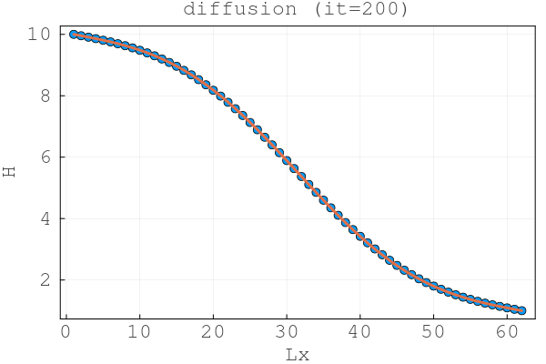
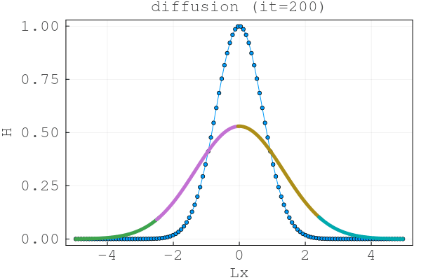
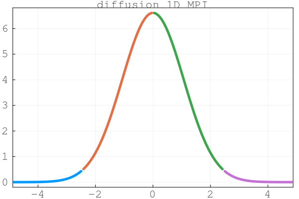
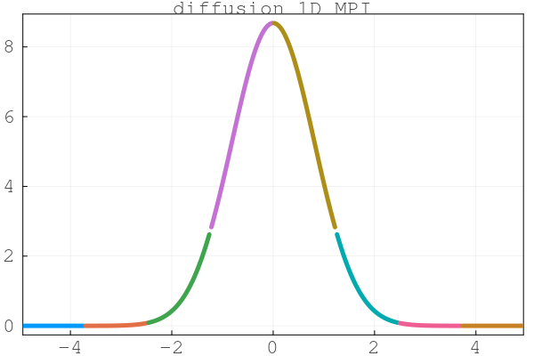
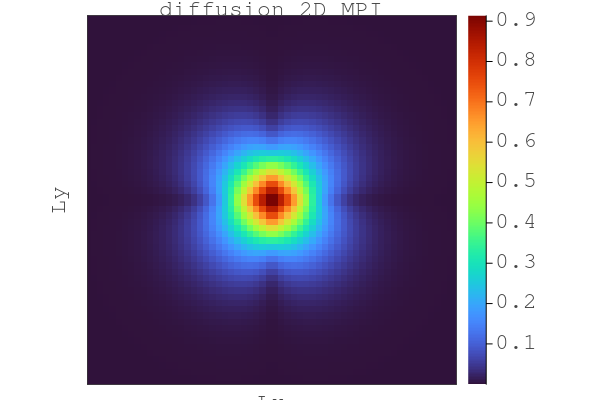
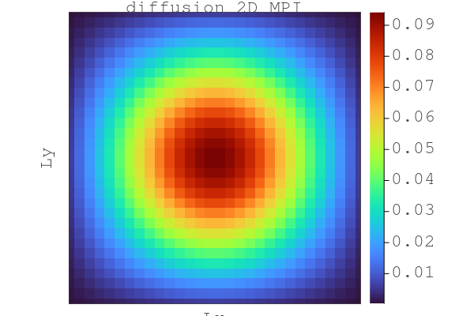
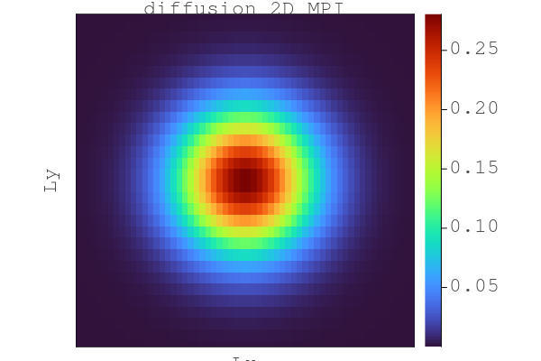
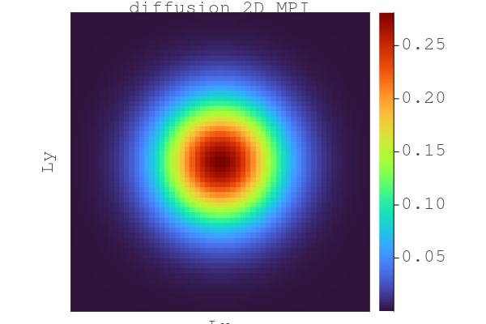
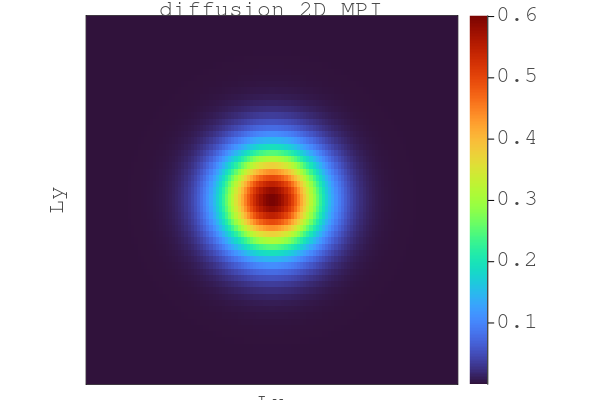
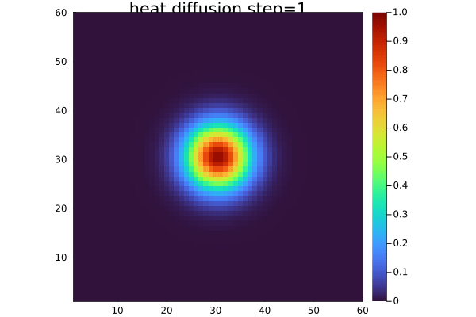

Lecture 8: Distributed computing

- Code exercise 8.1

                   -  `lecture8/scripts/diffusion_1D_2procs.jl`
                   -  `lecture8/scripts/diffusion_1D_nprocs.jl`
                   -  `lecture8/scripts/diffusion_2D_mpi.jl`
                   -  `lecture8/scripts/diffusion_2D_mpi_gpu.jl`


- Code exercise 8.2

                   -  `lecture8/scripts/diffusion_2D_perf_multixpu.jl`


## Code Exercise 8.1: Towards distributed memory computing on GPUs

### Task 1:  Finalise the scripts in class

*2-procs case:* 

For the 2-procs case no specific initial condition need to be taken into account, we don't necessarily need the global indices. A global array Cg is updated in the traditional way and plotted as comparison.

 


*n-procs case:* 

For the n-procs case we need to manually add several loops in order to update the halo of the local bounaries correctly. Also since we have a Gaussian as initial condition here, we need to utilize the global indexing in order to assign the initial condition for each process correctly

 


### Task 2:  Finalise the 2D MPI script in class

- `update_halo` allows for correct internal boundary exchange among the distributed parallel MPI processes

#### 1D MPI script

- as requested in the task, the 1D visualization of the work distribution is visualized as followed for 4-procs and 8-procs cases

 

 


#### 2D MPI script

**Version 0:** No halo-update

`n=4`

The incorrect update of the local boundary causes the incorrect value updates at the boundaries of each `C_loc`.

Here we can clearly see the amplified values in the center of the domain and the reduced values at the `y=Ly/2` and `x=Lx/2` lines.




**Version 1:** with halo-update

`n=1`



`n=2`



`n=4`




`n=8`




- The .gif animation shows the diffusion of the quantity C, running on 4 MPI processes 




The command used to launch the script was `mpiexecjl -n 4 julia --project diffusion_2D_mpi.jl`


### Task 3:  Finalise the 2D MPI script in class


- The following .gif animation shows the diffusion of the quantity C, running on 4 GPUs (MPI processes)

FIXME: add the animation


> Note what changes were needed to go from CPU to GPU in this distributed solver.

From the CPU to GPU solver we need to do `using CUDA` then we need to 

i). change the data movement from host to device and vice versa by using `copyto!` method 

ii). make sure the arrays on device are defined using `CuArray` or `CUDA.zeros`

and 

iii). we need to explicitly specify the shared-memory usage by adding the following lines

```julia
    comm_l = MPI.Comm_split_type(comm, MPI.MPI_COMM_TYPE_SHARED, me)
    me_l   = MPI.Comm_rank(comm_l) # per node numbering to obtain the GPU ID
    GPU_ID = CUDA.device!(me_l)
```


`mpiexecjl -n 4 julia --project diffusion_2D_mpi_gpu.jl`


## Code Exercise 8.2: Multi-xPU computing

